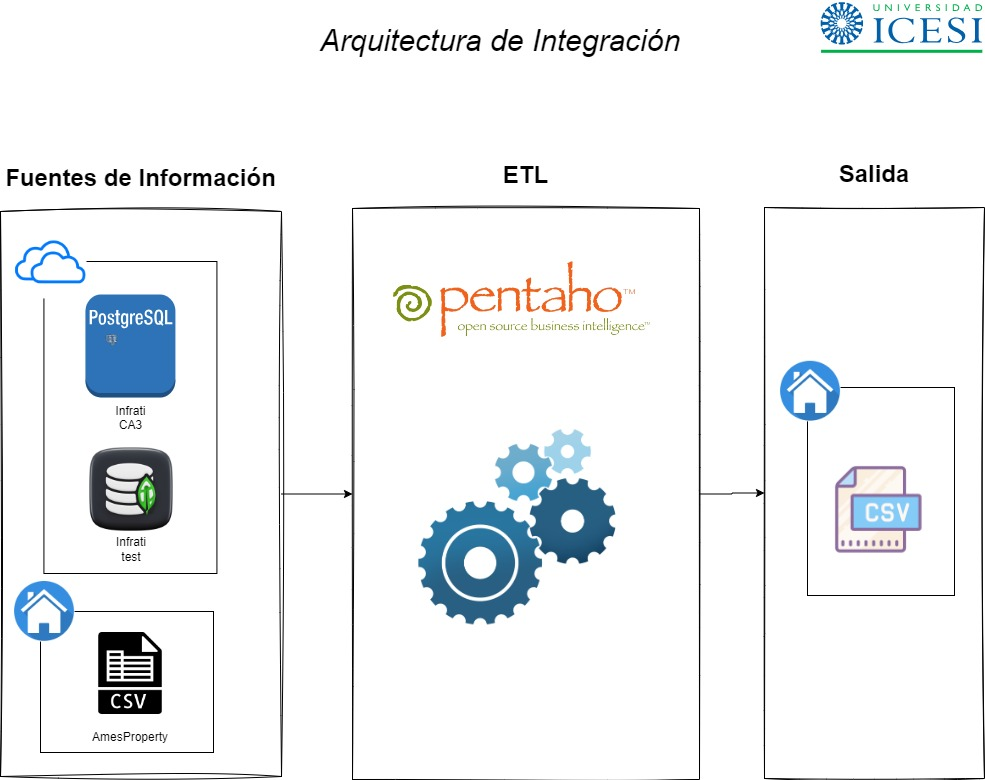

# 4. Construcción de las fuentes

# 4.1 Archivo CSV

Dado que es una fuente no relacional, en un paso posterior simplemente se realizará la conexion al disco duro.

# 4.2 Construcción de BD Relacional

Para este punto es necesario crear en el aplicativo "Elephant" una instancia para cargar las tablas respectivas, utilizando las credenciales del usuario principal.

El nombre de instancia utilizada será: "DB_CA3"

## 4.2.1 Construcción de tablas

Las tablas se construyeron y se poblaron utilizando un pipeline de scrips SQL sobre el aplicativo PENTAHO.

Los queries respectivos se encuentran en la carpeta "pipeline" archivo "CA3 Creacion de BD.ktr" y se listan a continuación:

    -Script Ames DB Creation
    -SQL script Upload mssubclass
    -SQL script Upload mszoning
    -SQL script Upload typequality
    -SQL Script Upload amesdbtemp
    -SQL script Upload saleproperty
    -SQL script Upload floordetail

**Nota importante**: este pipeline solo debe ejecutarse una sola vez, para no repoblar las tablas.

## 4.2.3 Construcción de vistas SQL.

Pendiente

# 4.3 BD Mongo 

Para MongoDB nos conectamos a la base "test" ya construida en el aplicativo "MONGODBCOMPASS" con el usuario de ICESI.  Las colecciones a las que debemos conectarnos son "bsmt", "garage", "misc" y "pool".

# 4.4 Arquitectura para la integración de fuentes

